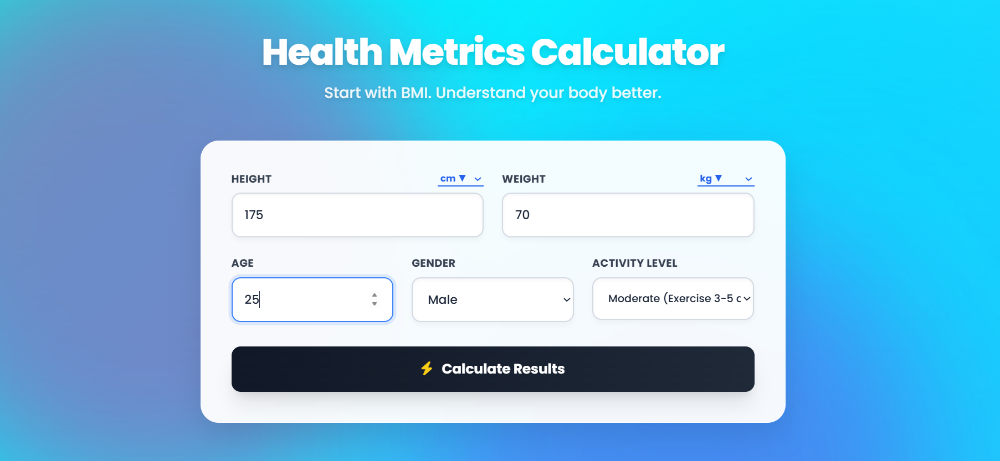

# 🧠 Health Metrics Calculator

An advanced **client-side Health Analysis Dashboard** that goes beyond basic BMI calculation by providing **multi-metric insights, visualizations, and actionable health feedback** — all running instantly in the browser.

> ⚡ No backend. No APIs. Pure HTML + CSS + JavaScript.

---

## 🌐 Live Demo

🚀 Try the hosted version here:  
👉 [Live Health Metrics Calculator](YOUR_HOSTED_LINK_HERE)

> No installation needed — runs instantly in your browser.

---

## 🌟 What Makes This Different?

Most calculators stop at:

👉 “Your BMI is 23”

This project goes further:

👉 Converts inputs → Calculates metrics → Visualizes results → Explains meaning → Suggests actions

So instead of just numbers, users get **understanding + direction**.

---

## 🚀 Project Evolution

This project is an improved version of an earlier system:

### 🔹 Previous Version

**Advanced BMI Calculator (Flask-based)**

### 🔹 Current Version

**Health Metrics Calculator (Fully Client-Side, Deployed Online)**

---

### 🔄 Key Improvements

| Old Version (Flask)      | New Version (Client-side)      |
| ------------------------ | ------------------------------ |
| Required backend server  | Runs directly in browser       |
| Basic BMI-focused output | Multi-metric analysis          |
| Static UI                | Interactive visual dashboard   |
| Limited insights         | Smart interpretations + advice |
| Slower workflow          | Instant calculations           |

---

## 🧮 Features

### ⚙️ Multi-Unit Input System

Supports real-world flexible inputs:

#### Height

* cm  
* meters  
* millimeters  
* inches  
* feet + inches (dual input)

#### Weight

* kg  
* grams  
* lbs  
* oz  

👉 Internally normalized to **cm + kg**

---

### 📊 Health Metrics Calculated

| Metric                   | Purpose                    |
| ------------------------ | -------------------------- |
| **BMI**                  | Weight vs height ratio     |
| **Body Fat %**           | Estimated body composition |
| **BMR**                  | Calories burned at rest    |
| **TDEE**                 | Total daily calorie burn   |
| **Healthy Weight Range** | Based on BMI 18.5–24.9     |

---

### 🧠 Formulas Used

#### BMI

```

BMI = weight (kg) / height² (m)

```

#### Body Fat %

```

Male:   1.20 × BMI + 0.23 × Age − 16.2
Female: 1.20 × BMI + 0.23 × Age − 5.4

```

#### BMR (Harris-Benedict)

```

Male:   88.362 + 13.397W + 4.799H − 5.677A
Female: 447.593 + 9.247W + 3.098H − 4.330A

```

#### TDEE

```

TDEE = BMR × Activity Level

```

---

## 📈 Visualization System

This project focuses heavily on **making data understandable visually**.

### 🎯 BMI Gauge

* Semi-circular SVG meter  
* Needle rotates based on BMI  
* Color-coded health zones  

---

### 📍 Weight Position Tracker

* Shows:
  * Your current weight  
  * Ideal weight range  

* Includes:
  * Highlighted target zone  
  * “YOU” marker  

---

### 📊 Body Fat Bar

* Visual percentage scale  
* Indicates lean → high fat levels  

---

### 🔥 Energy System

* BMR vs TDEE representation  
* Calorie target marker for:
  * Gain / Maintain / Loss  

---

## 🧠 Insight & Recommendation Engine

This is the core logic layer of the project.

### ✅ Category Detection

* Underweight  
* Healthy  
* Overweight  
* Obese  

---

### ⚠️ Edge Case Handling

* High BMI + low fat → possible muscular case  
* Normal BMI + high fat → possible “skinny fat”  

---

### 💬 Conversational Feedback

Example:

```

"You are 4.5 kg above your healthy range"

```

---

### ⏳ Goal Estimation

* Assumes safe rate:

```

0.5 kg per week

```

* Estimates time to reach healthy range  

---

### 🍽️ Actionable Suggestions

Each category includes:

* Nutrition advice  
* Activity guidance  
* Lifestyle improvements  

---

### 🎯 Calorie Strategy

| Category    | Strategy        |
| ----------- | --------------- |
| Underweight | Calorie surplus |
| Healthy     | Maintain        |
| Overweight  | Mild deficit    |
| Obese       | Strong deficit  |

---

## 🎨 UI / UX Highlights

* Glassmorphism cards  
* Animated gradient background  
* Floating ambient orbs  
* Smooth number animations  
* Staggered result reveal  
* Tooltip explanations  
* Screen pulse feedback based on health status  

---

## 📸 Preview

### 🖼️ UI Overview



---

### 📹 Demo States

#### 🟢 Healthy Case


#### 🔴 Obese Case


#### 🔵 Underweight Case


---

## 🛠️ Tech Stack

* HTML5  
* Tailwind CSS  
* Vanilla JavaScript  
* SVG (for gauge)  
* Font Awesome  

---

## 🚀 How to Use

### 🌐 Option 1 — Live Demo (Recommended)

Use the hosted version directly in your browser:

👉 [Live Health Metrics Calculator](YOUR_HOSTED_LINK_HERE)

---

### 💻 Option 2 — Run Locally (New Version)

Open the file:

```

health-metrics-calculator/index2.html

````

---

### 🧪 Option 3 — Run Legacy Flask Version

```bash
cd advanced-bmi-calculator
pip install flask
python app.py
````

Then open:

```
http://127.0.0.1:5000
```

---

## 📂 Legacy Project (Old Version)

The folder:

```
advanced-bmi-calculator/
```

contains the earlier implementation which:

* Used Flask backend
* Focused mainly on BMI calculation
* Had a simpler UI and fewer insights

This version demonstrates the **initial system design**, while the new version shows **refactoring into a faster, more interactive architecture**.

---

## 🤖 What This Project Demonstrates

* Strong JavaScript logic & DOM manipulation
* Real-world formula implementation
* Data → visualization mapping
* UI/UX thinking with interactive feedback
* Ability to refactor and improve an existing system

---

## ⚠️ Disclaimer

This tool is for **educational purposes only**.

BMI does not account for:

* Muscle mass
* Bone density
* Body composition differences

Consult a medical professional for accurate health advice.

---

## 🙋‍♂️ Author

**Aayush Dattatray Kadam**
AI & ML Engineering Student

🔗 [https://github.com/Aayushinit](https://github.com/Aayushinit)

---

## 🔮 Future Improvements

* Save user history (local storage)
* Export report (PDF)
* More health metrics (e.g., waist ratio)
* Voice input
* Mobile app version

---

